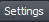

# Segment Anything Model (SAM) in Napari

Segment anything with our **Napari** integration of Meta AI's new **Segment Anything Model (SAM)**!

SAM is the new segmentation system from Meta AI capable of **one-click segmentation of any object**, and now, our plugin neatly integrates this into Napari.

We have already **extended** SAM's click-based foreground separation to full **click-based semantic segmentation and instance segmentation**!

At last, our SAM integration supports both **2D and 3D images**!

----------------------------------

Everything mode             |  Click-based semantic segmentation mode |  Click-based instance segmentation mode
:-------------------------:|:-------------------------:|:-------------------------:
  |    |  

----------------------------------
<h2 align="center">SAM in Napari demo</h2>

https://user-images.githubusercontent.com/3471895/236152620-0de983db-954b-4480-97b9-901ee82f8edd.mp4

----------------------------------

## Installation

The plugin requires `python>=3.8`, as well as `pytorch>=1.7` and `torchvision>=0.8`. Please follow the instructions here to install both PyTorch and TorchVision dependencies. Installing both PyTorch and TorchVision with CUDA support is strongly recommended.

Install Napari via [pip]:
    
    pip install napari[all]

You can install `napari-sam` via [pip]:

    pip install git+https://github.com/facebookresearch/segment-anything.git
    pip install napari-sam

To install latest development version :

    pip install git+https://github.com/MIC-DKFZ/napari-sam.git

## Usage

1. Start Napari from the console with:

        napari

    Then navigate to `Plugins -> Segment Anything (napari-sam)` and drag & 
   drop an image into Napari.

2. Auto-download one of the available SAM models (this can take 1-2 minutes).
   Change the `Annotation mode` and `Segmentation mode` to what you want.
   Optionally, adjust  tab to suit your task (see below).

3. Generate the labels layers where SAM predictions will be output using the 
`Add 
annotation layers` button which will 
automatically 
generate the label layers you specify in the `Settings` tab as `List of 
labels to segment` and then activate SAM annotation mode. Alternatively you can 
   add labels layers 
   using the  button in the napari viewer and then press `Activate`.

4. When SAM 
   annotation mode is activated, you are ready to edit the annotations 
   using 
   either
   - **Positive click** (point that should 
     be in annotation): Middle mouse button (in Point mode)
   - **Negative click** (point not 
     inside annotation): Ctrl + middle mouse button (in Point mode)
   - **Draw BBox**: Left click and drag (in BBox mode) 
   - **Undo**: Ctrl + Z
   - **Increment label**: M
   - **Pick label**: Ctrl + left click
   - **Eraser brush**: 1
   - **Paintbrush**: 2
   - **Fill**: 3
   

5. Click on a different labels layer at any time to switch to annotating 
   that layer instead. You can also `Deactivate` and then re-`Activate` SAM 
   annotation mode at any time.

6. Once you've finished annotating the image, click `Finished annotating image` 
   to save all labels layers in same folder as image was loaded from, 
   create an excel file with metrics about the annotated objects and slices 
   (which 
   can be 
   customised in 
   the `Settings` tab) and clear all current layers - so you're ready to drag 
   & drop another image and start again!

Note that napari-sam assumes that you have 
   only one image open in Napari at a time (this can be across multiple 
   image layers e.g. each layer being a separate channel of the one image as 
long as all image layers correspond to the same image). 

## Settings

Optional settings to customize your workflow. napari-sam will cache the 
settings that you 
enter (so no need to enter them each time you open the plugin).

### Data
* `List of 
  labels to 
  segment`: 
  comma separated list of 
  each label to segment (e.g. _glomerulus,tubule,stroma_). If you wish to do semantic segmentation within a 
  layer you can separate the labels info with a dash (e.g. _graft-host_ means 
  label with paint number 1 = graft, label 2 = host), otherwise DO NOT USE 
  DASHES in label layer names.
* `Folder containing presaved image embeddings`: generating embeddings of 
  3D images takes a lot of time and memory when done on the fly so if 
  you run into problems at this stage (e.g. a progress bar for 'Generating SAM 
  embedding' that doesn't move or 
  freezes)
  consider 
  using a bash script to submit to your own computer or a high 
  performance computing cluster BEFORE you begin annotating. Then paste the 
  filepath of the folder where you've 
  saved the embeddings generated from the bash script here 
  (e.g. _C:\Documents\SAM_embeddings_).

### Metrics & Graphs
* `Filepaths for image information spreadsheet`: Metadata 
  spreadsheet with each row corresponding to an image and each column 
  various information about that image e.g. experimental conditions. Must 
  include a column with the heading "Image" containing the image name 
  without the file extension (e.g. _cells3d_ NOT _cells3d.png_)
* `Filepath for collated output metric files`: If you want all metrics from 
  all images you ever annotate to be saved to the same excel (.xlsx) file then 
  enter 
  the folder that you want to contain the xlsx file here.
* `Label(s) to record other label areas as a percentage of`: Optional label 
  name 
  that you want all other label areas to be recorded as a percentage of (e.g.
  _graft-host_,_nephron_ means that all other label areas like glomeruli, 
  tubule areas will be recorded as a percentage of graft-host and nephron 
  annotations respectively)
* `Paint number of label to record other labels as a percentage of`: For the 
  label(s) above, specify if you want all paint numbers (with ALL or leave 
  blank) or just specific paint numbers to be used to record other labels 
  areas as a percentage of (e.g. if _graft-host_,_nephron_ is entered above 
  then _1,ALL_ would mean only labels with paint number 1 in labels layer 
  _graft-host_ (so the graft label) would have a percentage area of all 
  other labels taken against it but all labels in _nephron_ labels layer would 
  have a percentage area of all other labels taken against it).
* `Label to calculate min distance from other labels` with optional =[INTEGER] 
  to specify paint number of label to use: Measures the minimum Euclidean 
  distance 
  between pixels of every object in labels and the specified labels layer
  (e.g. _graft-host=2_ means all 
  label objects would have distance from the label 2 in _graft-host_ (so the host)
  calculated in the metrics. _nephron_ means all objects would have closest 
  distance to any _nephron_ object measured). Note only one label can be 
  specified.
* `In each annotated slice, record non-empty label layers only`: If ticked, 
  the slice sheet of the resulting excel document will exclude all labels 
  layers that are not annotated for that slice. If you have labels 
  that are not represented in some image slices, leave this unticked so that 
  their area of 0 will be recorded for those slices.

The xlsx files generated can be used to create graphs.

----------------------------------
## Contributing

Contributions are very welcome. Tests can be run with [tox], please ensure
the coverage at least stays the same before you submit a pull request.

## License

Distributed under the terms of the [Apache Software License 2.0] license,
"napari-sam" is free and open source software

## Issues

If you encounter any problems, please [file an issue] along with a detailed description.

[napari]: https://github.com/napari/napari
[Cookiecutter]: https://github.com/audreyr/cookiecutter
[@napari]: https://github.com/napari
[MIT]: http://opensource.org/licenses/MIT
[BSD-3]: http://opensource.org/licenses/BSD-3-Clause
[GNU GPL v3.0]: http://www.gnu.org/licenses/gpl-3.0.txt
[GNU LGPL v3.0]: http://www.gnu.org/licenses/lgpl-3.0.txt
[Apache Software License 2.0]: http://www.apache.org/licenses/LICENSE-2.0
[Mozilla Public License 2.0]: https://www.mozilla.org/media/MPL/2.0/index.txt
[cookiecutter-napari-plugin]: https://github.com/napari/cookiecutter-napari-plugin

[file an issue]: https://github.com/MIC-DKFZ/napari-sam/issues

[napari]: https://github.com/napari/napari
[tox]: https://tox.readthedocs.io/en/latest/
[pip]: https://pypi.org/project/pip/
[PyPI]: https://pypi.org/

# Acknowledgements

napari-sam is developed and maintained by the Applied Computer Vision Lab (ACVL) of [Helmholtz Imaging](http://helmholtz-imaging.de) 
and the [Division of Medical Image Computing](https://www.dkfz.de/en/mic/index.php) at the 
[German Cancer Research Center (DKFZ)](https://www.dkfz.de/en/index.html).
