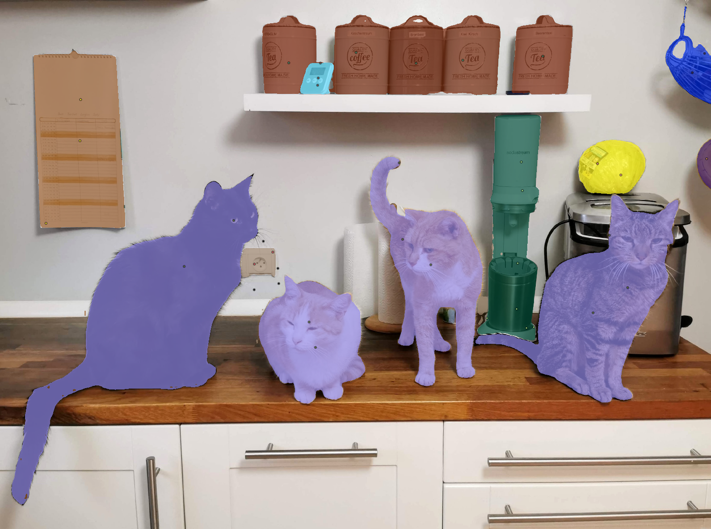
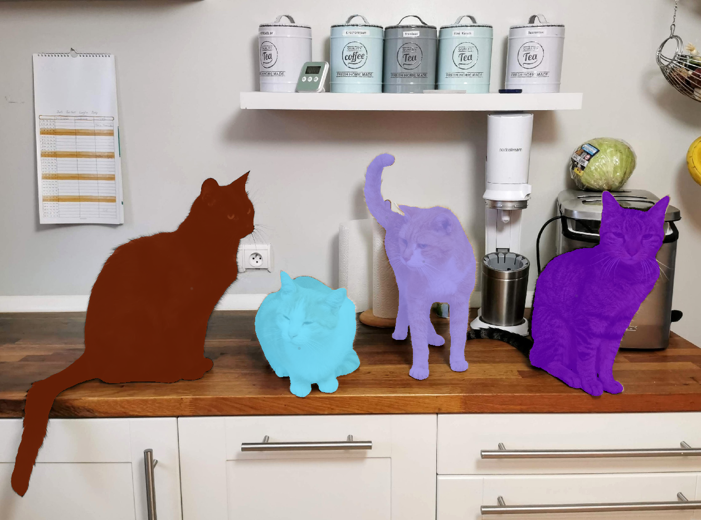
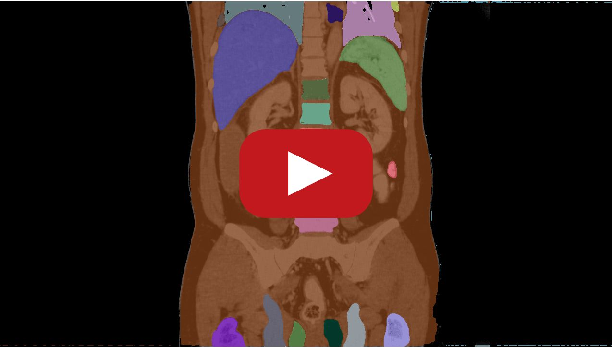

# Segment Anything Model (SAM) in Napari

Segment anything with Meta AI's new SAM model with thi Napari plugin!

SAM is the new segmentation system from Meta AI capable of **one-click segmentation of any object** and now our plugin neatly integrates this into Napari.

We already **extended** SAMs click-based foreground separation to full **click-based semantic segmentation & instance segmentation**!

----------------------------------

Everything mode             |  Click-based semantic segmentation mode |  Click-based instance segmentation mode
:-------------------------:|:-------------------------:|:-------------------------:
  |    |  

----------------------------------
<h2 align="center">SAM in Napari demo</h2>

<em>Click to play the video</em>

  

----------------------------------

## Installation

The plugin requires `python>=3.8`, as well as `pytorch>=1.7` and `torchvision>=0.8`. Please follow the instructions here to install both PyTorch and TorchVision dependencies. Installing both PyTorch and TorchVision with CUDA support is strongly recommended.

You can install `napari-sam` via [pip]:

    pip install git+https://github.com/facebookresearch/segment-anything.git
    pip install napari-sam

To install latest development version :

    pip install git+https://github.com/MIC-DKFZ/napari-sam.git

## Contributing

Contributions are very welcome. Tests can be run with [tox], please ensure
the coverage at least stays the same before you submit a pull request.

## License

Distributed under the terms of the [Apache Software License 2.0] license,
"napari-sam" is free and open source software

## Issues

If you encounter any problems, please [file an issue] along with a detailed description.

[napari]: https://github.com/napari/napari
[Cookiecutter]: https://github.com/audreyr/cookiecutter
[@napari]: https://github.com/napari
[MIT]: http://opensource.org/licenses/MIT
[BSD-3]: http://opensource.org/licenses/BSD-3-Clause
[GNU GPL v3.0]: http://www.gnu.org/licenses/gpl-3.0.txt
[GNU LGPL v3.0]: http://www.gnu.org/licenses/lgpl-3.0.txt
[Apache Software License 2.0]: http://www.apache.org/licenses/LICENSE-2.0
[Mozilla Public License 2.0]: https://www.mozilla.org/media/MPL/2.0/index.txt
[cookiecutter-napari-plugin]: https://github.com/napari/cookiecutter-napari-plugin

[file an issue]: https://github.com/MIC-DKFZ/napari-sam/issues

[napari]: https://github.com/napari/napari
[tox]: https://tox.readthedocs.io/en/latest/
[pip]: https://pypi.org/project/pip/
[PyPI]: https://pypi.org/
